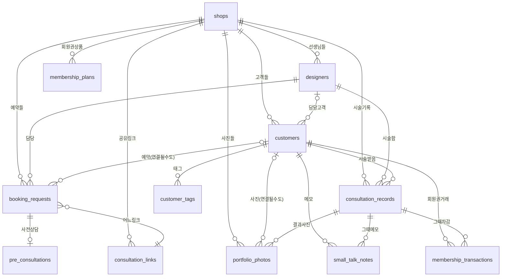

# BDX 기능 & 데이터 지도 🗺️

> "이 앱이 뭘 하고, 데이터가 어디에 어떻게 들어가는지" 한 방에 감 잡는 문서.
> 개발 용어는 최소화하고, **바이브코딩하는 사람** 기준으로 풀어 씀.
> (정확한 컬럼/제약은 Supabase 콘솔이 최종 진실. 이 문서는 멘탈 모델용.)

---

## 0. BDX 한 줄 요약

**네일샵 사장님이 외국인 손님이랑 상담할 때 쓰는 다국어 앱.**
손님은 시술 전에 폰으로 "이런 거 하고 싶어요"를 미리 고르고(=사전상담),
사장님은 그걸 받아서 예약 → 시술 → 결제 → 기록/포트폴리오까지 한 흐름으로 처리함.

- 사장님 화면(`/(main)/*`)은 **항상 한국어**
- 손님 화면(`/pre-consult/*`)은 **한/영/중/일** 골라서 + 한국어 보조 표시
- 데이터는 전부 **Supabase(Postgres)** 에 저장, 화면 상태는 **Zustand**(브라우저 메모리)가 들고 있다가 DB랑 동기화

---

## 1. 기능 지도 (화면별로 뭘 하나)

### 🏠 사장님 앱 (로그인 필요, 항상 한국어)

| 화면 | 하는 일 |
|------|---------|
| **홈** | 오늘 스케줄, 예약 카드("시술 시작" 버튼), 매출 빠른등록, 사전상담 링크 복사 |
| **기록** | 캘린더(주/월/일) + 예약 타임그리드 + 시술 기록 리스트. 날짜 클릭하면 그 날 예약만 |
| **고객** | 고객 목록/상세. 방문 횟수·총 매출·회원권 잔액·태그·스몰토크 메모·시술 이력 |
| **포트폴리오** | 디자인 사진 갤러리. "메뉴" 탭(손님에게 보여줄 메뉴판) + "시술 기록" 탭(카테고리별 전체 사진) |
| **대시보드** | 통계. 오늘/이번달 매출, 업셀링 리포트, 재방문율 등 |
| **설정** | 매장 정보·로고, 선생님(디자이너) 관리, 영업시간, 가격표/추가금, 커스텀 파츠, 회원권 상품, 테마 |

### 📱 손님 앱 (로그인 없음, 링크로 진입, 다국어)

| 단계 | 하는 일 |
|------|---------|
| **첫 화면** | "OO샵에서 보내드렸어요" + (링크 종류에 따라) 날짜·시간 슬롯 선택 |
| **디자인 선택** | 카테고리(심플/프렌치/자석·마그넷/아트…) → 포트폴리오 사진 고르기 |
| **상담 플로우** | 참고사진 업로드 → 현재 네일 상태(제거·연장) → 랩핑 → 길이 → 모양 → 느낌 → 추가옵션 |
| **확인(견적)** | 고른 거 요약 + 예상 가격/시간 → 이름·전화 입력 → 접수 |

### 💅 현장 모드 (`/field-mode/*`, 시술 중 태블릿)

| 단계 | 하는 일 |
|------|---------|
| **디자인 선택** | 손님이랑 같이 디자인 고름 |
| **옵션 선택** | 제거/길이/랩핑/추가옵션 미리 세팅 (예상 금액 뜸) |
| **시술 중** | 타이머 + "추가 항목"(랩핑·파츠 등 **수량 − N +** 로 추가) + 실시간 합계 |
| **정산** | 최종 금액 = 기본 + 추가금 − 할인 − 예약금, 결제수단(현금/카드/회원권), 회원권 차감 |
| **마무리(wrap-up)** | 시술 후 사진 저장, 포트폴리오 등록, 공유카드 생성, 고객 카드 연결 |

---

## 2. 데이터 엔티티 (테이블 = "데이터 보관함")

총 **12개 테이블**. 전부 `shop_id`를 갖고 있어서 "어느 매장 거냐"로 나뉜다.
(= 멀티테넌트. 한 DB에 여러 샵이 같이 사는 구조)

> 💡 **jsonb 컬럼 = "유연한 보따리"**: 구조가 자주 바뀌거나 복잡한 데이터는
> 컬럼을 일일이 안 만들고 통째로 JSON으로 쑤셔넣음. 빠르지만 검색/집계는 약함.

### 🏪 `shops` — 매장 (루트, 모든 것의 부모)
- 기본 정보: `name`, `phone`, `address`, `logo_url`, `theme_id`
- 기본 가격: `base_hand_price`(손 6만), `base_foot_price`(발 7만)
- `business_hours` (jsonb) — 요일별 영업시간
- `settings` (jsonb) — **확장 설정 보따리**: 추가금(surcharges), 시간 설정, 제공 서비스 목록, 커스텀 파츠 등
- `onboarding_completed_at` — 온보딩 끝났는지

### 👩‍🎨 `designers` — 선생님/디자이너
- `role`: `owner`(원장) | `staff`(직원)
- `pin`(4자리), `is_active`, `profile_image_url`
- 1인샵이면 원장 1명만 있음

### 🧑 `customers` — 고객 (핵심!)
- 기본: `name`, `phone`, `assigned_designer_id`(담당쌤), `preferred_language`
- 통계: `visit_count`, `total_spend`, `average_spend`, `is_regular`(단골), `visit_frequency`
- `preference` (jsonb) — 취향(선호 모양/색 등)
- `treatment_history` (jsonb) — 과거 시술 요약 배열
- **`membership` (jsonb) — ⚠️ 회원권이 별도 테이블이 아니라 고객 안에 박혀 있음!**
  - 금액제(충전권): `purchaseAmount`(충전액) / `remainingAmount`(잔액) / `usedAmount`(사용액) / `expiryDate`
  - (회차 필드 totalSessions 등은 레거시, 신규는 0)

### 🏷️ `customer_tags` — 고객 태그
- `category`(분류) + `value`(값), `is_custom`, `pinned`(고정), `accent`(색), `sort_order`
- 예: "취향:심플", "VIP" 같은 거

### 💬 `small_talk_notes` — 스몰토크 메모
- 손님이랑 나눈 대화 기록 ("강아지 키움", "다음에 결혼식 있다 함")
- `customer_id` + 선택적으로 `consultation_record_id`(어떤 시술 때) + 작성한 쌤

### 🧾 `consultation_records` — 시술/매출 기록 (= "영수증+카르테")
- `consultation` (jsonb) — 시술 내용 전체 보따리
- 금액: `total_price`(견적) / `final_price`(실수령) / `pricing_adjustments`(jsonb, 항목별 내역)
- 결제: `payment_method`(현금/카드/회원권), `secondary_payment_method`+`secondary_amount`(복합결제 차액)
- `membership_applied`(회원권 차감액), `deposit`(예약금), `upsell_amount`(업셀링)
- `is_quick_sale`(즉시매출인지), `finalized_at`(결제 완료 시각), `share_card_id`(공유카드)
- 👉 **매출 통계의 원천**. `final_price + membership_applied + deposit` = 시술 전액

### 📅 `booking_requests` — 예약 (= "예약 한 건")
- `customer_name`, `phone`, `reservation_date`, `reservation_time`
- `channel`: `kakao` | `naver` | `phone` | `walk_in` | `pre_consult`(앱 내 사전상담)
- `status`: `pending`(접수) | `confirmed` | `completed` | `cancelled`
- **`pre_consultation_data` (jsonb)** — 손님이 사전상담에서 고른 것 전부(가격 계산의 원본!)
- `deposit`(예약금), `consultation_link_id`(어떤 공유링크로 왔나), `designer_id`
- 👉 "시술 시작" 누르면 이 데이터를 현장모드로 **hydrate(불러오기)** 함

### 🖼️ `portfolio_photos` — 디자인/시술 사진
- `kind`: `reference`(온보딩·참고용) | `treatment`(실제 시술 결과)
- `style_category`: simple | french | magnet | art | custom-*
- `record_id`(어떤 시술), `customer_id`(온보딩 사진은 비어있을 수 있음)
- `price`, `design_type`, `color_labels`, `parts_memo`
- 뱃지: `is_featured`(대표) / `is_staff_pick`(추천) / `is_popular`(인기) / `is_public`(공개)

### 💳 `membership_transactions` — 회원권 거래내역
- `type`: `purchase`(충전) | `use`(차감) | `refund` | `adjust`
- `amount_delta`(금액 증감, +충전/−사용), `sessions_delta`(레거시 회차), `record_id`(어떤 시술 때 썼나)
- 👉 잔액 자체는 `customers.membership`에 있고, **여기는 "히스토리"** (이중 기록 구조)

### 📝 `pre_consultations` — 사전상담 (레거시 경로 전용)
- `data` (jsonb), `confirmed_price`, `design_category`, `booking_id`, `expires_at`(30일 후 만료)
- 👉 요즘은 대부분 `booking_requests.pre_consultation_data`로 들어감. 이건 옛날/특정 경로용

### 🔗 `consultation_links` — 공유 상담 링크 (현재 보류 = rows 0)
- 사장님이 날짜·시간 지정해서 만드는 슬롯 선택형 링크
- `valid_from`/`valid_until`, `estimated_duration_min`, `slot_interval_min`, `booking_count`
- 👉 **SL-01: 생성 UI는 아직 보류 상태** (DB 구조만 있고 화면 없음)

### 🎟️ `membership_plans` — 회원권 상품 템플릿
- 사장님이 설정에서 등록하는 "상품"(예: "10만원 충전권")
- `name`, `price`, `total_sessions`, `valid_days`
- 👉 이건 **템플릿**일 뿐. 고객한테 부여하면 실제 잔액은 `customers.membership`에 복사됨

---

## 3. ERD (관계도)

> 화살표 = "이 테이블이 저 테이블을 가리킴(외래키)".
> `shops`는 모두의 부모라 거의 모든 테이블이 `shop_id`로 매달려 있음(아래선 생략 多).

> 🖼️ 렌더된 이미지: **[`docs/erd.png`](erd.png)** (2860px 고해상도) · **[`docs/erd.svg`](erd.svg)** (벡터, 무한 확대) — 컬럼까지 다 보이는 버전.



**기호 읽는 법**: `||--o{` = 1:N (하나가 여러 개를 가짐), `|o--o{` = 0/1:N (연결 안 될 수도), `||--o|` = 1:0/1.

**중요 멘탈모델**:
- `shops` → (선생님 / 고객 / 예약 / 시술기록 / 사진 / 회원권상품 / 링크) 다 거느림
- `customers`가 두 번째 허브 — 태그·메모·시술·회원권거래가 다 고객에 매달림
- **회원권 잔액**은 테이블이 아니라 `customers.membership`(jsonb) 안에 있음 (← 자주 까먹는 포인트)
- `consultation_links`는 구조만 있고 데이터 0건 (보류)

---

## 4. 데이터 흐름 (핵심 시나리오 3개)

### A. 손님 사전상담 → 예약 → 시술 → 정산 (메인 흐름)
```
손님이 링크 클릭
  → 디자인/옵션 다 고름
  → 이름·전화 입력하고 "접수"
      ⇒ booking_requests 한 줄 생김 (channel='pre_consult',
         고른 거 전부 pre_consultation_data jsonb에 저장, deposit도)
  
사장님 홈/기록에서 그 예약 보고 "시술 시작"
  → pre_consultation_data를 현장모드로 hydrate (가격 그대로 재현)
  → 시술 중 추가 항목(랩핑 등) 수량으로 더함
  → 정산: final_price 확정, 결제수단 선택, (회원권이면 차감)
      ⇒ consultation_records 한 줄 생김
      ⇒ (회원권 썼으면) membership_transactions + customers.membership 잔액 갱신
      ⇒ 고객 통계(visit_count/total_spend) 갱신
  → wrap-up: 시술 사진 → portfolio_photos (kind='treatment')
```
> ⚠️ **가격 정합성의 핵심**: `pre_consultation_data`를 hydrate할 때 랩핑/파츠/사진단가/모양을
> 빠짐없이 옮겨야 "손님이 본 견적 = 계산대 금액"이 맞음. (이번 QA에서 캘린더·홈 경로 누락분 수정함)

### B. 회원권 (금액제 = 충전권)
```
설정에서 membership_plans 등록 ("10만원 충전권")
  → 고객 카드에서 부여
      ⇒ customers.membership(jsonb)에 purchaseAmount/remainingAmount 세팅
      ⇒ membership_transactions에 type='purchase' 기록

시술 정산에서 회원권 결제
  → min(잔액, 시술금액)만큼 차감, 모자라면 차액은 현금/카드
      ⇒ customers.membership.remainingAmount 줄고 usedAmount 늘고
      ⇒ membership_transactions에 type='use' (amount_delta = -차감액)
```

### C. 포트폴리오 (메뉴판 ↔ 시술기록)
```
온보딩에서 올린 사진 → portfolio_photos (kind='reference')
실제 시술 후 사진   → portfolio_photos (kind='treatment', record_id 연결)

"메뉴" 탭: 손님에게 보여줄 메뉴판 (대표/추천으로 고른 것)
"시술 기록" 탭: reference + treatment 전부를 카테고리별로 묶어 보여줌
```

---

## 5. 알아두면 덜 헤매는 패턴 ⚡

| 패턴 | 한 줄 설명 |
|------|-----------|
| **jsonb 보따리** | `settings`, `consultation`, `pre_consultation_data`, `membership`, `preference` 등은 통짜 JSON. 컬럼처럼 안 보이지만 데이터 많음 |
| **회원권은 테이블 아님** | 잔액은 `customers.membership`(jsonb), 내역만 `membership_transactions` 테이블 |
| **가격 계산기 2개** | `calculatePreConsultPrice`(카테고리 모델, 사전상담) vs `calculatePrice`(가산 모델, 레거시 캔버스). **섞으면 안 됨** |
| **Zustand ↔ Supabase** | 화면은 Zustand(브라우저)가 들고, `src/lib/db.ts` 함수들이 DB랑 동기화. db.ts가 모든 DB 호출의 단일 창구 |
| **RLS(보안)** | Supabase Row Level Security로 "내 샵 데이터만" 보이게 막음. 손님(anon) 키는 사전상담 제출만 가능 |
| **i18n 키** | `t('namespace.key')`. 키 없으면 그 키 문자열이 화면에 그대로 뜸(타입체크 못 잡음). 4개 언어(ko/en/zh/ja) 다 채워야 함 |
| **항상 한국어 vs 다국어** | `(main)/*`는 강제 한국어, `pre-consult/*`는 선택 언어+한국어 보조 |

---

## 6. 폴더 구조 빠른 지도

```
src/
├── app/
│   ├── (main)/        ← 사장님 앱 (home/records/customers/portfolio/dashboard/settings)
│   ├── pre-consult/   ← 손님 사전상담 (다국어)
│   ├── field-mode/    ← 현장 시술 (treatment/settlement/wrap-up)
│   └── onboarding/    ← 매장 첫 세팅
├── components/        ← UI 조각들 (settings/, customer/, portfolio/, field-mode/ …)
├── store/             ← Zustand 상태 (customer-store, field-mode-store, shop-store …)
├── lib/
│   ├── db.ts          ← 모든 DB 호출 창구 (Supabase)
│   ├── pre-consult-price.ts / price-calculator.ts  ← 가격 계산기 2종
│   ├── i18n.ts        ← 다국어 사전
│   └── analytics.ts   ← 통계 계산
├── types/             ← 데이터 모양 정의 (customer.ts, consultation.ts, database.ts …)
└── data/              ← 목업/기본값
```

---

*최종 업데이트: 2026-05-31 · DB 기준 실측(shops 12 / customers 86 / records 57 / bookings 78 / photos 81개 등)*
